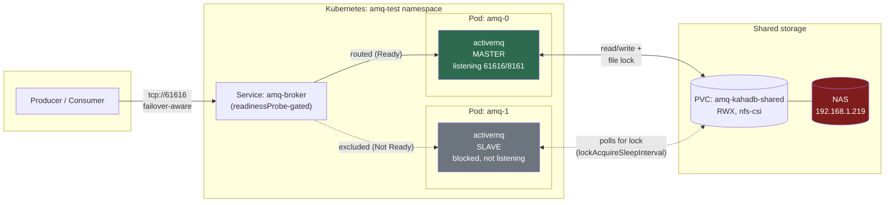
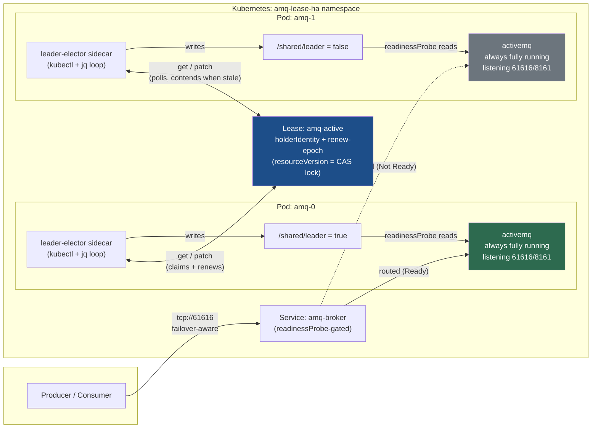

# ActiveMQ Active/Passive HA — Homelab Test

Two different ways to run Apache ActiveMQ 5.19.2 ("classic") active/passive
on the homelab Kubernetes cluster, tested live under load and failure. Pick
based on whether you need message durability:

| | Needs durability? | Doc |
|---|---|---|
| **KahaDB / shared storage** | Yes | [README-kahadb-ha.md](README-kahadb-ha.md) |
| **Kubernetes Lease election** | No | [manifests-lease-ha/README.md](manifests-lease-ha/README.md) |

## Architecture 1: KahaDB shared-storage master/slave

Election is implemented *as* a lock inside the persistence store itself —
there's no separate arbitration mechanism. Requires RWX shared storage
(NFS in this cluster), which also becomes a new single point of failure.

**Failure mode tested:** kill `amq-0` → `amq-1`'s KahaDB lock-poll acquires
the now-released lock (~6-9s) → it starts fully → Service Endpoints flip to
it. Persistent messages produced right before the kill survive (recovered
from the shared store); non-persistent ones don't.

## Architecture 2: Kubernetes Lease leader election

No shared storage, no persistence adapter at all (`persistent="false"`).
Each broker pod is fully independent; a sidecar in the same pod does
leader election against a `Lease` object (an etcd-backed lock — the same
primitive Kubernetes controllers use internally).

**Failure mode tested:** kill `amq-0` → its Lease entry goes stale after
`LEASE_TTL=15s` with no active renewal → whichever pod's poll loop hits
next claims it via a `resourceVersion`-guarded patch (~15-24s total,
observed both `amq-1` and a restarted `amq-0` win this race) → Service
Endpoints flip. Nothing survives a kill — there's no store, so any
unconsumed message is gone regardless of when it was produced.

## Summary of what was verified

| | KahaDB master/slave | Lease election |
|---|---|---|
| Shared storage required | Yes (RWX NFS) | No |
| Failover time (observed) | ~6-9s | ~15-24s |
| Persistent messages survive failover | Yes | N/A (no persistence) |
| Non-persistent messages survive failover | No | No |
| Peak throughput (non-persistent) | ~10,000 msg/sec | ~23,800 msg/sec (5 threads) |
| Client reconnect after failover | Automatic (`failover://` URL) | Automatic (`failover://` URL) |

Full details, exact commands, and caveats for each are in their respective
READMEs linked above. Neither is wired into Flux — both are
`kubectl apply -f <dir>/`-only, kept isolated from the rest of the
GitOps-managed homelab stack.
